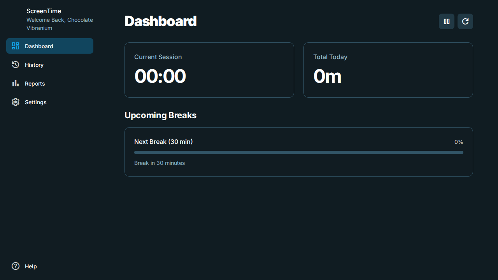
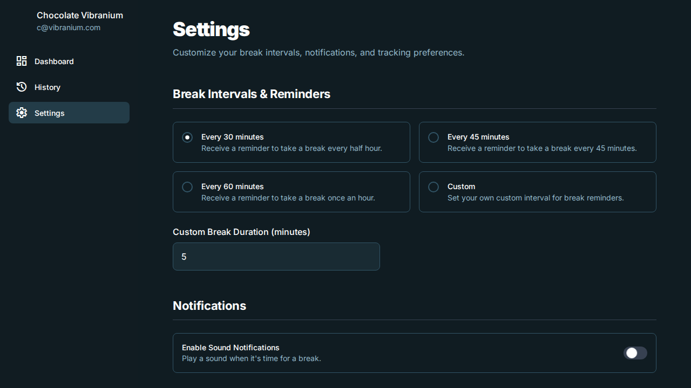
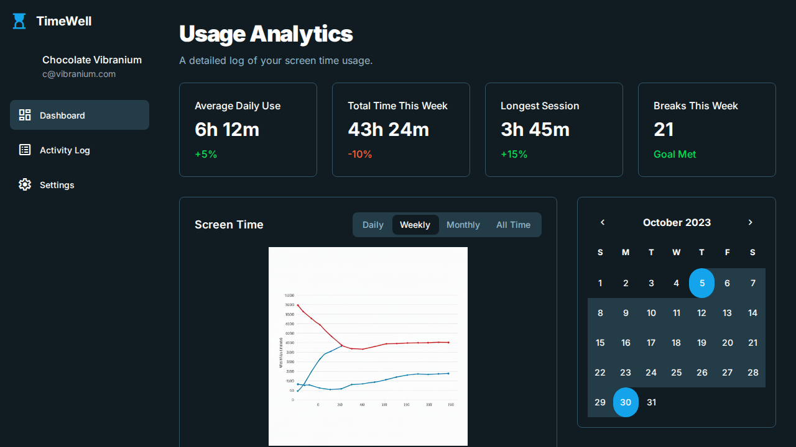
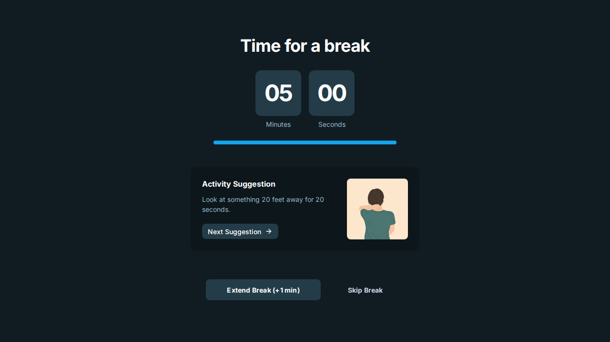

# Screen Time Tracking App

This is a simple web application to help you track your screen time and remind you to take breaks.

## How to Run

1.  Clone this repository to your local machine.
```
$ git clone https://github.com/gitatb/screen-time.git
$ cd screen-time
$ npm install
$ npm run start
```
2.  Open the `index.html` file in your web browser.

## Sample Images

### Dashboard


### Settings


### History


### Break Timer

